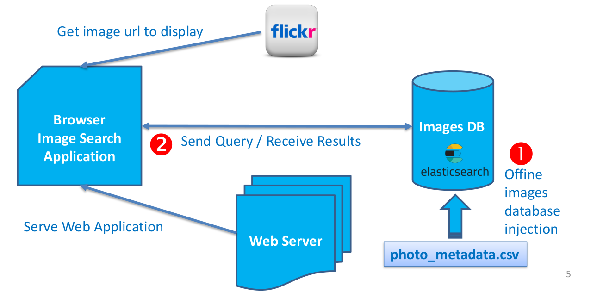
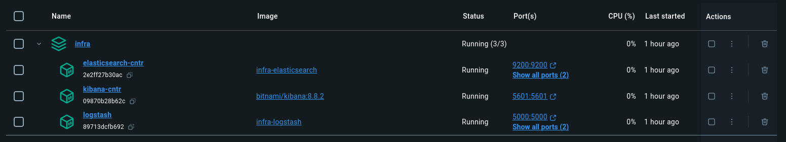
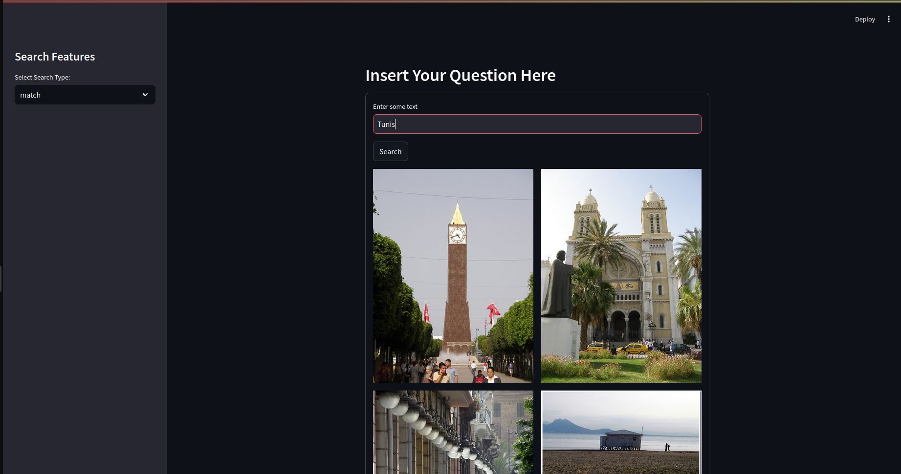

# ELK-Stack-SearchEngine

## Overview
Welcome to the  ELK-Stack-SearchEngine project! This application provides a powerful and intuitive way to search through extensive text datasets using Elasticsearch. When you perform a textual search, it retrieves and displays images from Flickr that match your query, leveraging both the Flickr website and the provided dataset. The search results are showcased through a user-friendly web interface built with Streamlit. To ensure easy access and sharing, ngrok is used to make the application available to a wider audience.

## Key Features

### Elasticsearch Integration
- **Efficient Search**: Utilize the powerful Elasticsearch search engine to index and search through extensive textual data. This ensures fast and accurate search results.

### Streamlit Web Interface
- **User-Friendly Interface**: Build an intuitive and interactive web interface with Streamlit. Users can easily perform searches, view results, and explore the data.

### Logstash Data Ingestion
- **Seamless Data Processing**: Use Logstash to ingest CSV data into Elasticsearch. This integration handles the collection, parsing, and indexing of data, facilitating smooth and efficient data ingestion.

## Application Architecture


## Folder structure

This project has the following file structure:

```
.
├── Frontend
│   ├── app.py
│   ├── requirements.txt
│   ├── style.css
│   └── utils
│       ├── __init__.py
│       └── streamlit_utils.py
├── infra
│   ├── data
│   │   └── photo_metadata.csv
│   ├── docker-compose.yml
│   ├── elastic
│   │   ├── create_index.py
│   │   ├── custom_cmd.sh
│   │   └── Dockerfile.elastic
│   └── logstash
│       ├── Dockerfile.logstash
│       └── pipeline
│           └── logstash.conf
.
```
## Dockerized Environment
To ensure seamless operation and management, our ELK-Stack-SearchEngine is built upon a Dockerized environment, encapsulating each component of the system within its own container. This approach not only fosters a modular architecture, making it easier to update and maintain individual parts without affecting the whole system, but also enhances scalability and fault tolerance. This setup not only reflects best practices in container orchestration but also provides a robust, scalable solution for data ingestion. By adopting this architecture, users can enjoy a streamlined setup process, predictable behavior across environments, and a flexible system ready to adapt to future needs and improvements.


## Setup and Running Instructions
1. Build & Start the Docker Containers: 
    ```
    docker compose -f infra/docker-compose.yml up -d --build
    ```
2. Install Python dependencies:
    ```
    cd Frontend
    pip install -r requirements.txt
    ```
3. Run Streamlit app:
    ```
    cd Frontend
    streamlit run app.py
    ```
## Result
